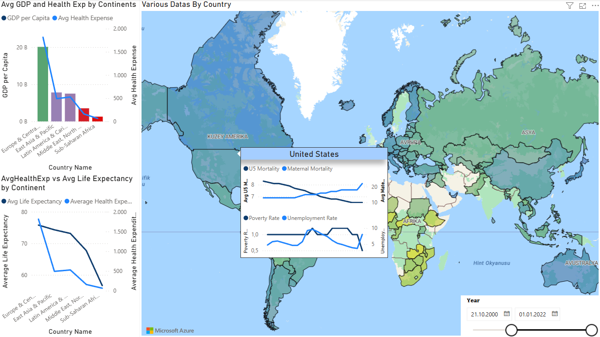
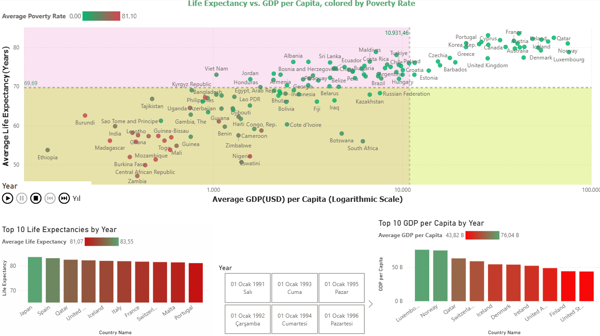

# ASA-DATAQUEST-2025-DATAWANKENOBI
*🥇 1st place in Data Visualization (Turkish Leg) and 2nd place in Data Analysis (Turkish Leg) at ASA Data Quest 2025: An analysis of the link between economic prosperity and life expectancy across 115 countries

*🧮 PROJECT OVERVIEW:
*As a third-year Statistics student, I developed this project alongside my teammates for the American Statistical Association (ASA) Data Quest 2025 competition. Our study focuses on a fundamental global question: How do economic indicators and healthcare investments shape the life expectancy of a nation? Using data from 115 countries provided by the World Development Indicators (WDI), we conducted an in-depth multivariate regression analysis and created a comprehensive visualization suite to uncover the socio-economic drivers of longevity.

*🔎 KEY RESEARCH FINDINGS:
*Our analysis revealed several critical insights into the relationship between prosperity and health:
*Model Performance: Our multivariate regression model successfully explained approximately 84% of the variance in life expectancy ($R^2 \approx 0.84$).
*The GDP Paradox: We discovered that while higher GDP per capita strongly correlates with increased life expectancy in high and upper-middle-income countries, its impact is not statistically significant in low-income nations, where health infrastructure plays a more vital role.
*Health Indicators: Maternal mortality and under-5 mortality rates were identified as the strongest negative predictors. A decrease in these rates shows a direct and significant boost to a nation's average life expectancy.Government Spending: There is a clear positive correlation between health expenditure per capita and longevity, but the efficiency of this spending varies significantly by region.
*Insignificant Factors: Interestingly, our model found that unemployment rates did not have a statistically significant impact on life expectancy when other socio-economic variables were controlled.

*🎨 MY CONTRIBUTION: DATA VISUALIZATION:
*In this award-winning project, I was solely responsible for the entire Data Visualization component. Because we won 1st place in Data Visualization, this part of the project is particularly special to me. My role involved: 
*Designing an end-to-end interactive dashboard in Power BI to make complex statistical findings accessible to a non-technical audience.

*Developing dynamic maps and time-series animations to show how life expectancy has evolved globally over the decades.

*This project allowed me to gain a deep, professional-level mastery of Power BI, including complex DAX measures, data modeling, and user-centric dashboard design. It taught me how to tell a compelling story with data, which was the key factor in our team's victory.

